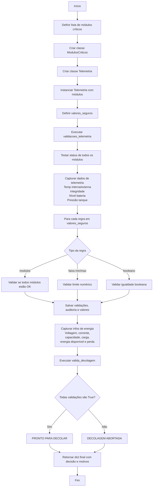

# FIAP CAP1 - Ignition Zero

## 📌 Explicação do projeto
Este projeto simula um **relatório operacional de pré-decolagem** de uma missão espacial.
A lógica principal está no notebook `main.ipynb`, onde são modelados:

- **Módulos críticos da aeronave/foguete** (computador de voo, navegação, comunicação etc.);
- **Sensores de telemetria** (temperatura interna/externa, pressão do tanque, nível de energia e integridade estrutural);
- **Regras de segurança** (`valores_seguros`) para validar se a decolagem pode ser autorizada.

Ao executar a validação, o sistema compara os valores capturados com os limites seguros e imprime:

- `Pronto para Decolar!` quando tudo está dentro da conformidade;
- `Falha na decolagem!` com os motivos de reprovação quando algum item está fora do padrão.

---

## 🧭 Fluxograma da lógica do código



### Ordem de leitura
1. **Coleta**: módulos e sensores geram dados simulados.
2. **Validação**: cada dado é comparado com `valores_seguros`.
3. **Auditoria**: o sistema registra regra, valor atual e motivo.
4. **Decisão**: se tudo estiver conforme, decola; caso contrário, aborta.

---

## ▶️ Instruções de execução do código
### Pré-requisitos
- Python **3.10+**

### Opção 1: Executar via Jupyter Notebook
1. Abra o arquivo `main.ipynb` no VS Code (com extensão Jupyter) ou Jupyter Lab.
2. Execute todas as células.
3. Verifique as saídas ao longo do notebook.


### Opção 2: Executar via script Python
Caso prefira terminal, você pode copiar a lógica do notebook para um arquivo `.py` e executar:

```bash
python nome_do_arquivo.py
```

> ℹ️ Como os dados são aleatórios, os resultados mudam entre execuções.

---

## 🖼️ Prints da execução  

Os prints da execução bem sucedida do código, está presente no arquivo PDF. Também é possível executar o código no Notebook Python e executar todas as células no notebook.

---

## 🔮 Melhorias futuras
- exportar relatório de auditoria para JSON/CSV;
- adicionar testes automatizados para validações;
- criar versão em script CLI com parâmetros de simulação;
- incluir métricas históricas de falhas por módulo.

---

## 👨‍💻 Autores
Projeto acadêmico FIAP — Capítulo 1.
### Luis Gustavo Ribeiro Andrade
    Formado em Economia pela FGV EPGE, trabalhou com modelos de Machine Learning ao longo da sua graduação. 
    Os modelos de Machine Learning apresentados no trabalho foram desenvolvidos com seu conhecimento prévio em Econometria e Estatística concedido pela sua graduação anterior.


> Observação: o projeto usa geração aleatória de valores, então os resultados podem mudar a cada execução.
