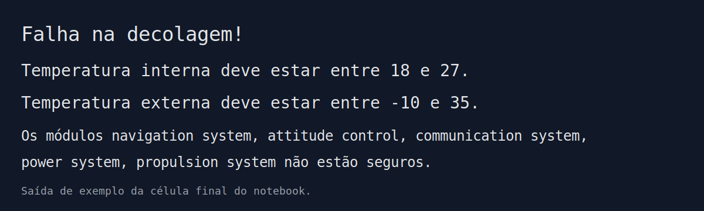

# FIAP CAP1 - Ignition Zero

## 📌 Explicação do projeto
Este projeto simula um **relatório operacional de pré-decolagem** de uma missão espacial.
A lógica principal está no notebook `main.ipynb`, onde são modelados:

- **Módulos críticos da aeronave/foguete** (computador de voo, navegação, comunicação etc.);
- **Sensores de telemetria** (temperatura interna/externa, pressão do tanque, nível de energia e integridade estrutural);
- **Regras de segurança** (`valores_seguros`) para validar se a decolagem pode ser autorizada.

Ao executar a validação, o sistema compara os valores capturados com os limites seguros e imprime:

- `Pronto para Decolar!` quando tudo está dentro da conformidade;
- `Falha na decolagem!` com os motivos de reprovação quando algum item está fora do padrão.

---

## 🖼️ Prints da execução
Exemplo de saída gerada durante a execução da validação de telemetria:



---

## ▶️ Instruções de execução do código
### Pré-requisitos
- Python **3.10+**

### Opção 1: Executar via Jupyter Notebook
1. Abra o arquivo `main.ipynb` no VS Code (com extensão Jupyter) ou Jupyter Lab.
2. Execute as células em ordem, do topo até a célula `valida_decolagem(valida, auditoria)`.
3. Verifique a saída no final do notebook.

### Opção 2: Executar via script Python
Caso prefira terminal, você pode copiar a lógica do notebook para um arquivo `.py` e executar:

```bash
python nome_do_arquivo.py
```

> Observação: o projeto usa geração aleatória de valores, então os resultados podem mudar a cada execução.
